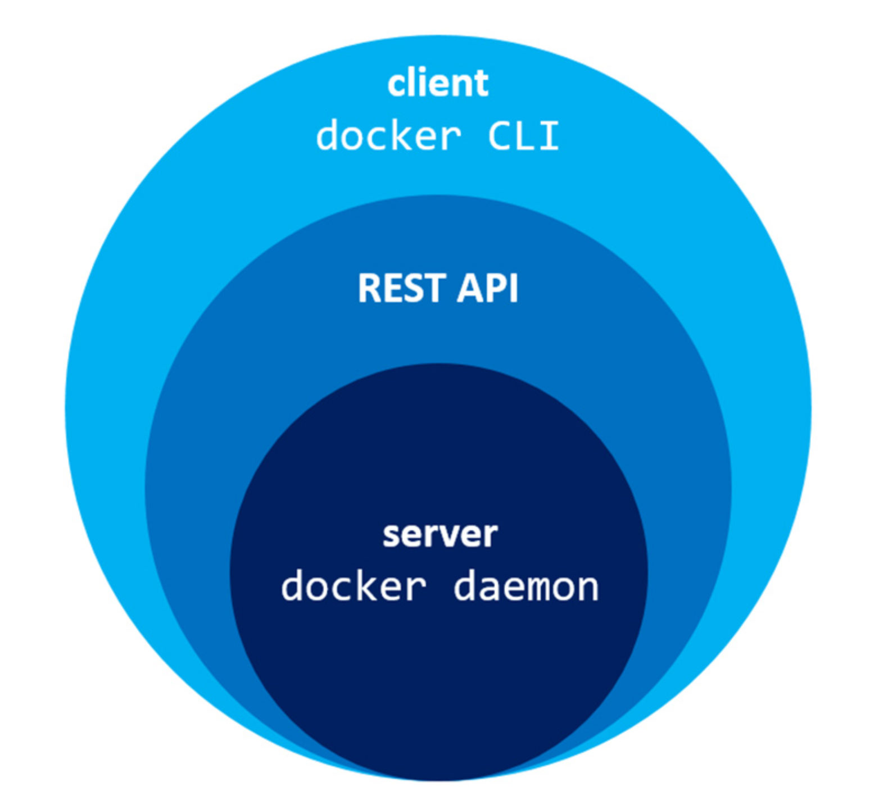
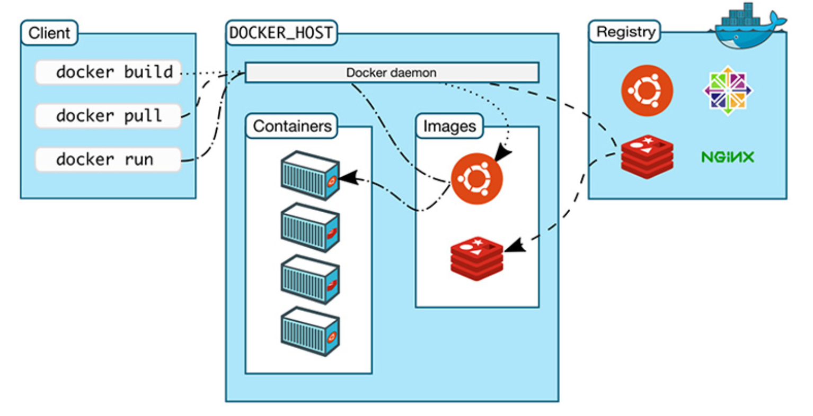

### Virtual Machines vs Docker Containers

Docker containers aren't VMs. Docker containers use less memory and start faster than virtual machines.
VMs good in isolating system resources and entire working inviroments, for example if you own webhosting company it's better to use VMs to separate ech customers. Docker isolates individual applications, not entire system.

#### Running apps using a VM on a server:
Starts in minutes

1. Infrastructure => Laptop, Server running in a data center, virtual private server in a cloud (for example Digital Ocean, Amazon)

2. Host Operating System => Mac Os, Windows, Linux

3. Hypervisor: 
	- Type 1: Direct link to the infrastructure (HyperKit(OSX)/Hyper-V(Win))
	- Type 2: Runs as an app on the host OS (VirtualBox/VMWare)

4. Guest Operating System

    - each Guest OS needs CPU and Memory resources as well as a disk space;
    - DB connection library;
    - Rupy, Python and NodeJS packages;

5. To isolate each apllications you need to run each one inside of his own Guest OS

#### Docker Containers
Starts in milliseconds

1. Ifrastructure => Laptop, Server running in a data center, etc.

2. Host Operating System => Mac Os, Windows, Linux

3. Docker Daemon is a service that runs in a background on Host OS and manages everything required to run and 
interact with Docker Containers

4. BINS/LIBS built-in into special packages Docker Images
	- Docker Daemon runs this Images

5. Each apps will be manage independently by the Docker Daemon
	- Docker Daemon communicates directly with Host OS;

#### VMs vs Docker

We can use VMs inside of Docker.

#### Docker's Architecture

*Docker daemon* is a service that runs on your host operating system. It runs only on Linex because it depends on a number of Linux kernel features.

*Docker daemon* itself exposes a *REST API*. From here, a number of different tools can talk to the daemon through this API. The most widespread tool is the Docker CLI. It is a command line tool that lets you talk to the Docker daemon. After Docker instalation, you get both Docker daemon and the Docker CLI tools together.

How Docker works:

Docker it's a Client <-> Server application. The Daemon is the server (or process), the CLI is one of many clients. There's also a number of third party clients.

#### Client -> Server Visualization 

1. Client on the left side, this is where we're running various Docker commands. The client could be installed on your laptop running MacOs, Windows or a server running Linux.

2. Docker host is the host that run the Docker daemon. Typically Docker host referred to as the server running Docker daemon.

It’s very simple to configure the Docker client to connect to a remote Docker host. This is one way you’re able to run Docker on MacOS and Windows.

Docker client and Daemon can communicate over an API, network interface and etc. The client and daemon doesn't need to be on the same machine.

3. Registry is a part of the Docker ecosystem. It's not something that's already istalled by defailt with Docker, but instead a place to find and download Docker images.

Docker Daemon and CLI are both written on Golang and open source.

#### Docker Community Edition vs Docker Enterprise Edition

*Docker CE* is free and open source, has the same core feautures as Enterprise Edition.

Docker CE has 2 release channels: 
	1. *Edge* releases are every month
	2. *Stable* releases are every 3 month

*Docker EE* is integrated, certified, and supported to provide enterprises with the most secure container platform in the industry.
	- certified images and plugins;
	- Docker DataCenter;
	- recieve vulnerability scans results on Docker Images;
	- official support;
	- releases are every 3 month, ech release is supported and maintained for entire year;

#### Docker Toolbox vs Docker for Mac

Docker Toolbox is an installation tool that pulls together and configures a number of things so that Mac OS or Windows can run Docker. It installs 6 tools:
	
	1. Docker Community Edition/Enterprise Edition
	
	2. Docker Compose
	
	3. Docker Machine - is part of Docker ecosystem. It's a command tool,helps you to create servers and get Docker installed on to those servers.

	Docker Toolbox + Docker Machine == Virtual Box VM with Docker installed
	
	4. Virtual Box - Docker Daemon requaires Linux and Mac Os or Windows are not running Linux you need Virtual Box(Type 2 Hypervisor) to run Linux. Docker Toolbox will install and configurate Virtual Box for you. Than it use Docker Machine to create a Virtual Machine, this Virtual machine will be running a lightweight distribution of Linux.
	
	5. Docker QuickStart Terminal - to use Docker open Docker QuickSTart Terminal. It directly installed by Docker Toolbox. It's a special terminal that when launched it'll automatically create a new server with Docker Machine if no server already exist.
	
	6. Kitematic is a graphical tool that let you manage your Docker Images and containers, it's optional.

	Unlike the Docker Toolbox, Docker for Mac/Windows doesn't required Virtual Box. Instead it uses *Type 1 Hypervisors* that comes with your OS - for MacOs: HyperKit and for Windows: Hyper-V. It installs : 
		1. Docker CE/EE
		2. Docker Compose
		3. Docker Machine

*Docker for Mac/Windows*
		
	- Need a type 1 hypervisor
	- Docker for Mac now lets you run Virtual Box 5+ at the same time! Window users still can't have VM
	- Yosemite 10.10.3+
	- Win 10(Pro, Ent, Stu)

*Docker Toolbox*

	- Need a type 2 hypervisor
	- Can't have HyperKit or Hyper-V already running with the Docker Toolbox 
	- Mountain Lion 10.8+
	- Windows 7+ (Home is ok)

#### Usability Concerns

*Docker for Mac/Windows*
	
	- Docker daemon running on local host
	- Access localhost
	- Any terminal you want
	- Windows subsystem for Linux can't run Docker natively

*Docker Toolbox*
	
	- Docker Daemon running on remote host, that's mean it no longer running on local host instead it'll running on local ip adress on your network

	- Access 192.168.99.100 or whatever VB gives you as a local ip adress
	- Docker QuickStart Terminal
	- Docker

#### Performance woes

*Docker for Mac/Windows*

	- Might be slower for certain use cases

*Docker Toolbox*

	- Might be faster for certain use cases

#### Docker Image vs Container?

**Docker Image** is a combination of a file system and parameters. It's a package that rolls up everything you need to run your application. No state and once build never changes. You can build a new version. Docker Image is something that you can download, buils and run.

 You can thing abount Docker Image as a class and Container is an instance of that class. One Image, many Containers.

 **Docker Containers** are immutable.

 #### Downloading and Storing Docker Images

 Running Docker Image creates a Docker Container. For example, for `docker run hello-world` you download hello-world Docker Image from the Docker Hub. **Docker Hub** is a part of Docker ecosystem, it allows you to find Docker Images and manage your own Images.

 Docker Hub is a Docker Registry. **Docker Registry** is a place where you can store Docker Images.

 *Docker Hub*
 	
 	- Store your Images
 	- Store free community Images
 	- Official Image
 	- Paid trusted images
 	- Keep tabs on paid content

#### Docker Build Process

Two ways to build Docker Images:

1. Run a Docker Container
	- Inside the container you can change and commit `docker commit `

2. Use Dockerfile, it has build steps for your application. It's a text file that you create and it read by Docker. Each step in inside the Dockerfile becomes a separate layer in your Docker Image. 

Docker Images may have one or more layers. Each layer has an id and file inside. Docker Image is a result when all years are joined.

#### Creating a Dockerfile

1. First `FROM` instruction. Use official base Docker Images. For example: `FFOM python: 3.6-alpine` from the left side is the Doker Image and fromthe right side the tag. If you skip the tag, it'll take the latest version.

2. Create a folder to store Flask app. Use `RUN` instruction, it allows you to run any script that you can normally run inside your base Images Operating System without Docker:
`RUN mkdir /app`
3. `WORKDIR /app` here we pass directory or directories.

4. `COPY requirements.txt requirements.txt` takes source and destination
5. `RUN pip install -r requirements.txt`

6. `COPY . .` first period - copy at the same level as Dockerfile and below, second period - is a destination.

#### 